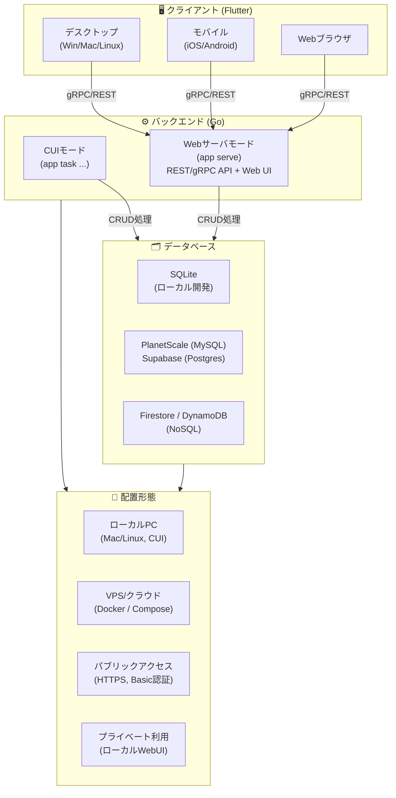
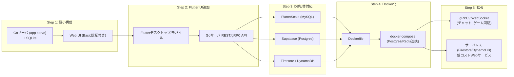

# 🏗 アーキテクチャ検討まとめ

## 🎯 目的

- 個人用の本番データベースを **月額500円以下** で運用する
- **複数のDBサービスを併用**（MySQL / PostgreSQL / NoSQL）して依存を避ける
- ローカル / VPS / クラウド / パブリック / プライベート利用すべてをカバー
- バックエンドは **Goで統一**（CUI＋サーバ処理）、UIは **Flutter**（クロスプラットフォーム）

## 📌 条件

- コスト最優先（500円以下必須）
- 外部アクセス可能（API / Web UI / モバイルアプリ）
- アクセス制御あり（IP制御 or 認証ベース）
- ローカルPC（macOS/Linux、CUI環境）でも開発・実行可能
- VPS/クラウドに配置して本番稼働可能
- Docker推奨だが、Docker不可環境ではGoバイナリ直実行で代替
- 配布は **Dockerイメージ＋Goバイナリの二段構え**

## 🏗 バックエンド（Go）

- 単一バイナリ（CUI兼サーバ処理）
- サブコマンドでモード切替
  - `./app serve` → Webサーバモード（REST/gRPC、Web UI表示）
  - `./app task ...` → タスク実行モード（CUIユーティリティ）
- DB接続：
  - 開発 → SQLite
  - 本番 → PlanetScale（MySQL）、Supabase（Postgres）、Firestore/DynamoDB
- セキュリティ：Basic認証（開発用）、将来JWT/OAuthへ拡張可
- Web UI内蔵：起動したら http://localhost:8080 にCRUD画面を表示

## 🎨 フロントエンド（Flutter）

- クロスプラットフォーム対応（デスクトップ、モバイル、Web）
- 内部DBを持ちオフライン対応（SQLite/Hiveなど）
- 外部通信：Goサーバと gRPC/REST で接続
- 利用ケース：
  - ゲームUI（チャット、FPS）
  - 非リアルタイムUI（ブログ、TODO、メモ）

## 🗂 データベース構成

- **RDBMS**
  - PlanetScale（MySQL、IP制御あり、無料枠あり）
  - Supabase（Postgres、APIキー＋RLS、無料枠あり）
- **NoSQL**
  - Firestore（低アクセスなら無料、SDKで簡単）
  - DynamoDB（AWS統合・IAM制御、スケーラブル）
- **ローカル開発**
  - SQLite（依存少なく軽量）

## 📦 デプロイ方式

- ローカル開発：
  - Goバイナリ直実行（SQLite利用）
  - Flutter UIは localhost:8080 へ接続
- VPS/クラウド：
  - DockerでGoサーバ常駐
  - 将来は docker-compose でPostgresやRedisも管理
- 配布：
  - Dockerイメージ → 環境再現用
  - Goバイナリ → Docker不可環境用

## 🔄 運用パターン対応

- レンタルサーバ → 制約多いが配置可能
- 外部VPS → 自由度高、Goサーバ常駐
- パブリックアクセス → HTTPS公開（Basic認証＋TLS）
- 簡易セットアップ → `go build` / `docker run` で即利用
- プライベート利用 → ローカルCLI / ローカルWebUI

## 🕹 ユースケース網羅性

- リアルタイム系（FPS、チャット） → gRPC/WebSocketサーバ（VPS配置）
- 非リアルタイム系（ブログ、TODO、メモ） → REST API + Flutter UI
- API定義を `.proto` / OpenAPI で共通化
- CUI / Web / モバイル / ゲームすべて同じAPI契約で動作

## 🛠 ロードマップ

1. SQLite＋Goサーバ（WebUI付き）
   - `./app serve` で即アクセス可（Basic認証）
2. Flutter UI
   - TODO/メモUIを作りGoサーバと連携
3. DB切替対応
   - Postgres/MySQLへ差し替え可能に
4. Docker化
   - VPSで `docker run` or `docker-compose up` で運用
5. 拡張
   - gRPC/WebSocket対応（ゲーム・チャット）
   - サーバレス利用（Firestore/DynamoDB）でWebサービスを低コスト運用

## 図

## ロードマップ

